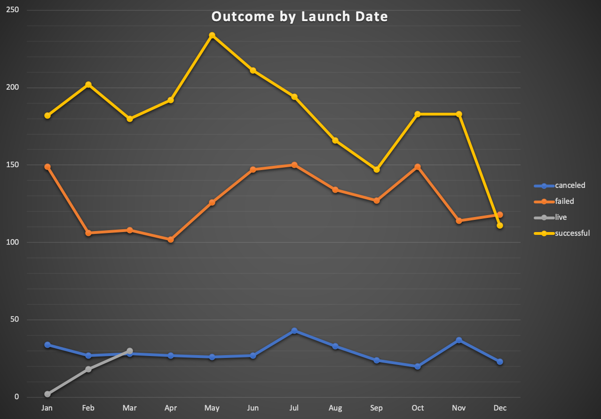
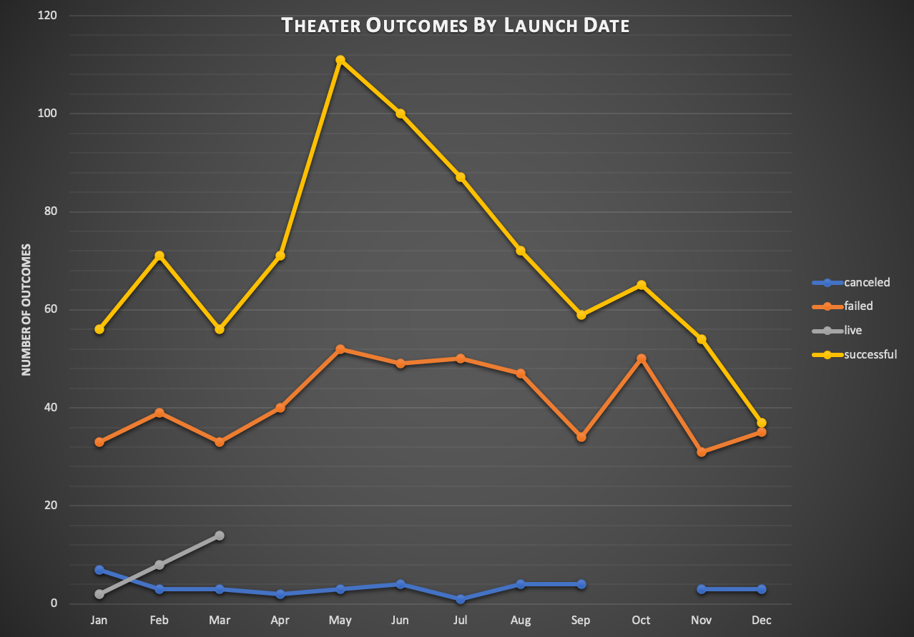
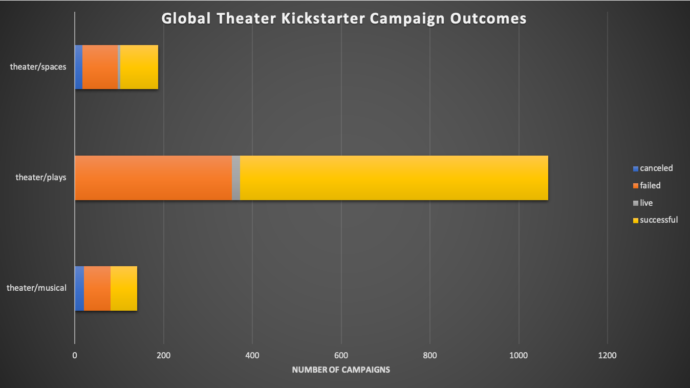
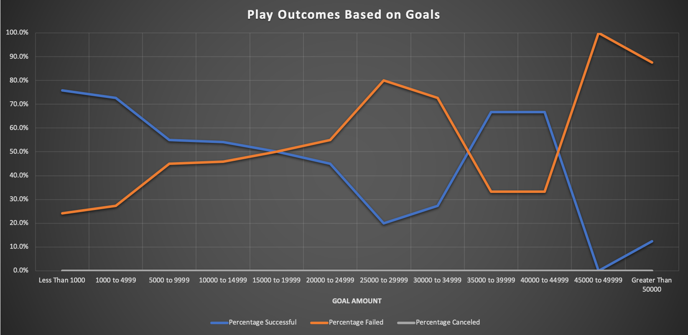

# Analysis Of Kickstarter Campaigns

## An in-depth analysis of Kickstarter Campaigns to guide Louise in fundraising efforts.

### Impacts Of Campaign Launch Date
#### Success and failure can vary throughout the year for all industries in campaigns researched:  Technology, Theater, Food, Film, Etc.

#### Theater campaign breakdown

### Favorable Theater Campaigns
Fortunately, theater campaigns are largely successful across the board, with roughly 66% success for **Play** campaigns.

This is great news for starting your campaign, so we can to further consider the goals and pledge results of past campaigns to guide your starting point and set expectations.

#### Play Campaign Goals For Success
Based on data for play campaigns in the **US**:
* 75% of Successful campaigns had a Goal of $5,000 or less
* Average Successful Goal: $5,049
* 75% of Successful campaigns received $5,700 or less
* Average Successful Pledge: $5,602
* Failed US Play campaigns largely showed higher goals near $10,000

Based on data for play campaigns in **Great Britain**:
* Average campaign Goal: $4,000
* 50% of campaigns had a Goal of $2,000 or less
* 75% of campaigns received $1,500 or less

### Challenge
#### Challenge Analysis
The data provided insight into Theater outcomes based on the time of year it was launched:

Global play outcomes were largely successful, but correlation to specific goal amounts was inconclusive:

#### Conclusion and Recommendation
After analyzing the relevant data provided, my conclusion and recommendations for your campaign are:
* There was inconclusive analysis surrounding the specific theater/play funding objectives.  A deeper look into the purpose of each campaign, and their relation to funding goals, might provide further insight.  Categorizing specific theater or play campaign objectives that match your goals would be beneficial.
* Launch US campaign in May, June, or July.  Avoid early and late months of the year.
* Set campaign goal to $5,000 or less (USD).  Having lofty goals higher than this amount largely failed to meet their goals.
* See your campaign through to the end.  Historically there have been no canceled play campaigns so it would be beneficial to capture as much funding as possible, despite not necessarily trending to meet your goal.
